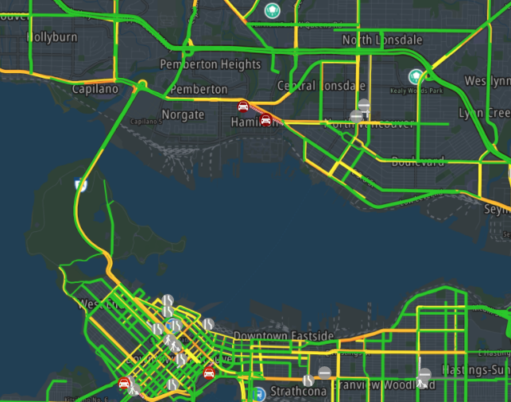
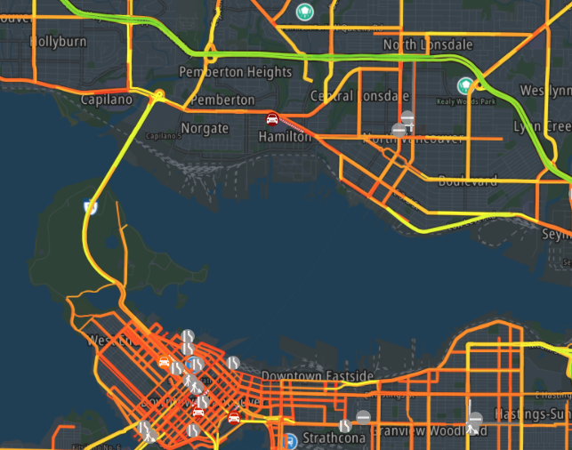
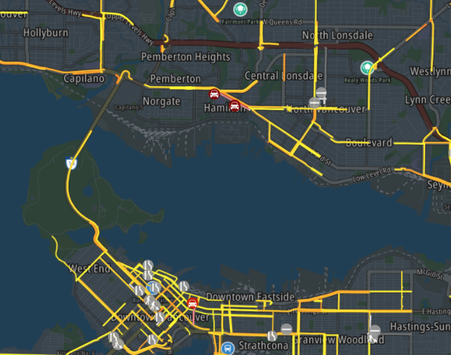

# MMM-TomTomTrafficIncidents
2023-04-26 - This module is still being maintained. But for now nothing to maintain except to follow TomTom development guidelines and changes.

This Magic Mirror Module shows a map with traffic and incidents information from TomTom. You can select which way the traffic should be displayed. Should a road with slow speed limit marked red, or only when there is a congestion going on? It also to shows the traffic incidents as icons. Like accidents, road blocks, etc..
Big difference with Google and Bing Maps is that it is really free for 2.500 request, no money will be charged when you go above this limit. No credit card credentials are needed. And TomTom has the option to display traffic in different ways.

The module uses the Version 6 of the maps SDK for Web (v6).




# Configuring the Module
To use this module, add the follwing configuration to your `config/config.js` file. In this examle I've chosen Vancouver BC.
````javascript
	modules: [
		{	
		module: "MMM-TomTomTrafficIncidents",
		position: "top_center",
		config: {
			key: "yourkey",
			lng: -123.1139529,
			lat:  49.2608724,
			zoom: 11,
			height: "500px",
			width: "800px"
		},
	]
````
The following settings can be changed.

## Required settings.
### key from TomTom
- `key`: Default `""`
In order to get the data from TomTom, a developers key is required. A key can be obtained free, and without the need of a credit card, from the developers site. At [developer.tomtom.com](https://developer.tomtom.com) you can register yourself. When your registration is a success, the site will guide you to create a key for you application.
The key is free for 2.500 transactions on daily basis. When this limit has been reached, an error "HTTP 403 – Over the limit error" will be given. See refresh in Optional Settings for more information.

- `lng`: Longitude default none.
- `lat`: Latitude default none.
Select your longitude and latitude. You can obtain from [maps.ie](https://www.maps.ie/coordinates.html) the longitude and latitude for places. Or use Google Maps to get the longitude and latitude of your desired location. You can find them after the @ sign in the address bar. If you keep lng and lat settings empty, TomTom will go to longitude 0 and latitude 0. [That](https://mydrive.tomtom.com/en_us/#mode=search+viewport=0,0,5,0,-0+ver=3) is somewhere under Ghana in the Atlantic Ocean/Gulf of Guinea.

## Optional settings you want to change
- `height`: Height in CSS unit. Default `"75vh"`.
- `width`: Width in CSS unit. Default `"75vw"`.
Here you can set the height and width of the map in any [CSS unit style](https://developer.mozilla.org/en-US/docs/Learn/CSS/Building_blocks/Values_and_units). Try, and see what size suits the best for you.

- `zoom`: zoom level of the map. Default `11`.
Zoom level can be between 0 - 24. Higher numbers will zoom in while lower numbers will zoom out.

- `lang`: language specified in config.js under language.

## Optional Settings you might want to change
- `traffic`: `"absolute"`/`"relative"`/`"relative-delay"` . Default `"relative"`
Here you can select in which way traffic should be displayed. There are three options: absolute, delay, and relative delay.
- `absolute`: Roads will be marked green for high speed and marked red for low speed traffic..

- `relative`: Roads will be marked green for normal traffic speed and marked red when traffic speed is slower than normal.

- `relative-delay`: Only the roads where the traffic speed is slower than normal will be marked on the map.

- `reduced-sensitivity`: T.B.D.


- `showMarker`: This will show a marker on the map. Ideal to locate your home. Default `false`.
- `mlat`: Latitude of your marker.
- `mlng`: Longitude of your marker.
- `mwidth`: Width in pixels of the marker. String. Default: `"30"`.
- `mheight`: Height in pixels of the marker. String. Default: `"36"`.

- `refresh`: integer that is the amount of ms for a refresh of traffic and incident information. Default `(15 * 60 * 1000)`. Equals 15 minuts.
On TomTom you get 2.5000 transactions on daily basis for free. When you reach the limit, "HTTP 403 – Over the limit error" errors will be shown in the log of MagicMirror.
The calculation of the amount of request is hard to guess. It depends on the amount of accidents and traffic. But 2.500 requests is hard to reach. 15 incidents count as one requests.

- `showIncidents`:  `true`/`false` default is `true`
Shows incidents like road blocks, incidents, narrowing, road construction etc. etc. on the map.
- `showTraffic`: `true`/`false` default is `true`
If you want to display traffic.
- `shoePOI`: `true`/`false` default is `false`
If you want to display point of interests.

## Optional Settings you shouldn't care about
- `remoteTTCSSJS`: `true`/`false` default is `false`
The following settings is only needed when you the  maps.css, traffic-incidents.css, and maps-web.min.js from TomTom site. This could be a legal requirement.

- `TTVersion`: version in string default is `"6.12.0"`
Whenever TomTom releases a new version, and remoteTTCSSJS is set to true, this value can be changed to the most current version. It is advisable not to use the TomTom server. When the the api.tomtom.com is not reachable, this part of the module will stall. It is at the moment not possible to fix this due technical reasons.

# Troubelshooting
Please verify first if you can get the tomtomv6.html working by loading this page on computer that runs the Magic Mirror.E.g. the Raspberry Pi. Don't forget to add your key in this file on line 18. This is the most simple example and gives some great hints where the rootcause may be. Is it this code, your API-key or perhape the computer itself?
If your code is still not working. Pleae check if you can make a working example from https://developer.tomtom.com/maps-sdk-web-js/functional-examples with your key. Most errors are not in the code, but in the configuration. Sometimes the TomTom module gives strange errors that can't be derived from the root cause.
When the module is not loading, check in the browser debugger what section Network writes. There you might find the 403 codes with response text like invalid key for example. There is working HTML file called tomtomv6.html that should work when you add your key in the source code.
In case of black square, please see https://github.com/Travelbacon/MMM-TomTomTrafficIncidents/issues/4 and https://forum.magicmirror.builders/topic/13938/black-screen/7 for solution.

# Using Raspberry PI 3 (black screen issue)
Wth the version raspbian Raspberry Pi OS (Legacy)](https://www.raspberrypi.com/news/new-old-functionality-with-raspberry-pi-os-legacy/) and the open GL fake KMS in the raspi-config (6 Advanced options / A2 GL driver / G2 GL Fake KMS) the PI should work.
[See Issue #4](https://github.com/Travelbacon/MMM-TomTomTrafficIncidents/issues/4#issuecomment-1340614169) Thanks to Jeff for solving this issue.

# LICENSING from TomTom
The files maps.css, traffic-incidents.css, and maps-web.min.js are licensed by TomTom. Read the [LICENSE.txt](./tomtom-international-web-sdk-maps/LICENSE.txt) in the folder tomtom-international-web-sdk-maps for details
