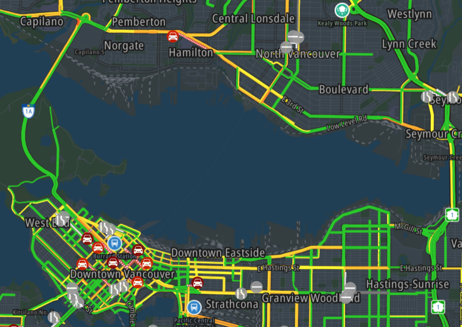
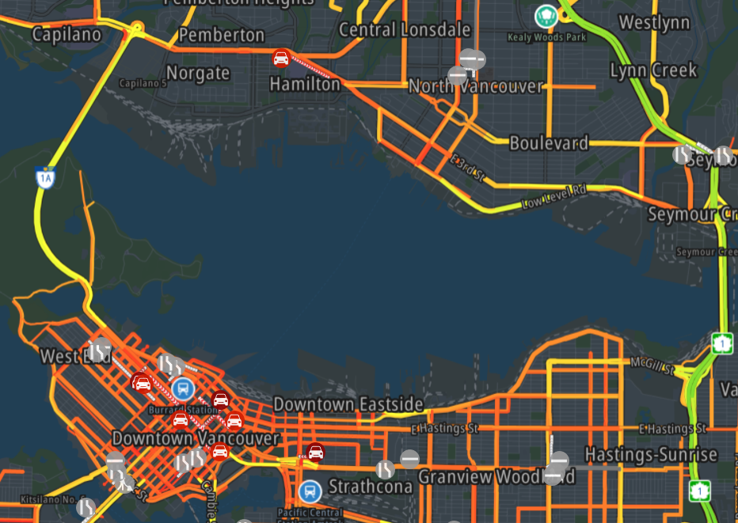

# MMM-TomTomTrafficIncidents
This Magic Mirror Module shows a map with traffic and incidents information from TomTom. You can select which way the traffic should be displayed. Should a road with slow speed limit marked red, or only makred red when there is a real congestion going on? This module also to shows the traffic incidents as icons. Like accidents, road blocks, etc..
Big differences with Google and Bing Maps is that it is really free for 2.500 request, no money will be charged when you go above this limit. No credit card credentials are needed to get a key. TomTom has advanced option to display traffic in different ways. Where Google Maps might indicate a slow speed road allways as congested, TomTom have the option to mark it as not congested with the option relative.
The module uses the public preview V5. TomTom expects to release V5 to the public within a few months. Don't worry that the module will stop working.  If you keep remoteTTCSSJS setting to it's value of false. The module will use the local stored javascript and css files and not use the files from TomTom site.

# Installing the module
You only need to download the file MMM-TomTomTrafficIncidents.js and the folder tomtom-international-web-sdk-maps to make the module run.

# Configuring the Module
The following settings can be changed.

## Required settings.
### key from TomTom
- `key`: default `""`
In order to get the traffic data from TomTom, a developers key is required. A key can be obtained without charge, and without the need of a credit card, from the developers site. At [developer.tomtom.com](https://developer.tomtom.com) you can register for a key. When your registration is a success, the site will guide you to create a key for you application.
The key is free for 2.500 transactions on daily basis. When this limit has been reached, an error "HTTP 403 – Over the limit error" will be given. See refresh in Optional Settings for more information.

- `lng`: longitude default none.
- `lat`: latitude default none.
Select your longitude and latitude. You can obtain from [maps.ie](https://www.maps.ie/coordinates.html) the longitude and latitude for places. Or use Google Maps to get the longitude and latitude of your desired location. You can find them after the @ sign in the address bar. If you keep lng and lat settings empty, TomTom will go to longitude 0 and latitude 0. [That](https://mydrive.tomtom.com/en_us/#mode=search+viewport=0,0,5,0,-0+ver=3) is somewhere under Ghana in the Atlantic Ocean/Gulf of Guinea.

## Optional settings you want to change
- `height`: height in CSS unit. Default `"75vh"`.
- `width`: width in CSS unit. Default `"75vw"`.
Here you can set the height and width of the map in any [CSS unit style](https://developer.mozilla.org/en-US/docs/Learn/CSS/Building_blocks/Values_and_units). Try, and see what size suits the best for you.

- `zoom` : zoom level of the map. Default `11`.
Zoom level can be between 0 - 24

- `lang` : [ISO 3166 land code](https://en.wikipedia.org/wiki/ISO_3166-1). Default `""`
If no language code is set, it will commonly get EN/English. This the language setting of your operating system, not the setting of `language` in config.js.

## Optional Settings you perhaps want to change
- `traffic`: `"absolute"`/`"relative"`/`"relative-delay"` . Default `"relative"`
Here you can select in which way traffic should be displayed. There are three options: absolute, delay, and relative delay.
- `absolute`: roads will be marked green for high speed and marked red for low speed traffic..

- `relative`: roads will be marked green for normal traffic speed and marked red when traffic speed is slower than normal.

- `relative-delay`:  only the roads where the traffic speed is slower than normal will be marked on the map.

- `refresh`: integer that is the time in ms for a refresh of traffic and incident information. Default `(15 * 60 * 1000)`. Equals 15 minuts. Minimum is 30.000. Any value lower than 30.000 will be treated as 30.000.
On TomTom you get 2.5000 transactions on daily basis for free. When you reach the limit, "HTTP 403 – Over the limit error" errors will be shown in the log of MagicMirror.
The calculation of the amount of request is hard to guess. It depends on the amount of accidents and traffic. But 2.500 requests is hard to reach. 15 incidents on a map count as one requests. So does 15 traffic informations. But when a traffic incident or report is not new, it is not a new request. Even for a crowsed metropole area is 2.500 very hard to reach with a decent refresh rate of say every 5 minutes.

- `showIncidents`:  `true`/`false` default is `true`
Shows incidents like road blocks, incidents, narrowing, road construction etc. etc. on the map.
- `showTraffic`: `true`/`false` default is `true`
If you want to display traffic.

## Optional Settings you shouldn't care about
- `remoteTTCSSJS`: `true`/`false` default is `false`
The following settings is only needed when you the  maps.css, traffic-incidents.css, and maps-web.min.js from TomTom site. This could be a legal requirement.

- `TTVersion`: version in string default is `"5.39.0"`
Whenever TomTom releases a new version, and remoteTTCSSJS is set to true, this value can be changed to the most current version. It is advisable not to use the TomTom server. When the the api.tomtom.com is not reachable, this part of the module will stall due MM properties. It is at the moment not possible to fix this stallation due technical properties of Magic Mirror.

# LICENSING from TomTom
The files maps.css, traffic-incidents.css, and maps-web.min.js are licensed by TomTom. Read the [LICENSE.txt](./tomtom-international-web-sdk-maps/LICENSE.txt) in the folder tomtom-international-web-sdk-maps for details
